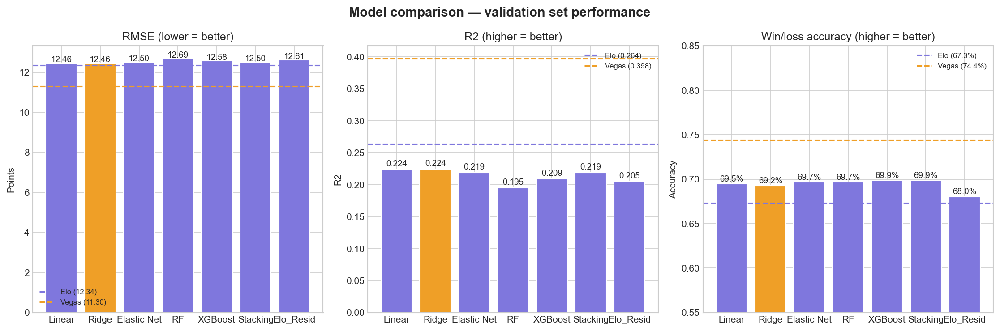

# College Basketball Game Prediction Model

Machine learning system for predicting NCAA basketball point differentials and win probabilities using Elo ratings, recreated efficiency metrics, rolling team statistics, and engineered stylistic matchup features.

## Project Overview

This project explores predictive modeling for NCAA basketball games using both traditional rating systems and custom-engineered matchup features.

The system predicts:
- Point differential (regression target)
- Win probability (derived from predicted margin distributions)

The project emphasizes:
- Leakage-free rolling feature engineering
- Time-aware validation
- Benchmark-driven evaluation against Elo and Vegas markets
- Exploration of stylistic matchup effects beyond raw team strength

Feature sets include:
- Elo ratings and recreated adjusted efficiencies
- Rolling Four Factors statistics
- Momentum-weighted performance metrics
- Game control and disruption features
- Pythagorean expectation and luck indicators

## Validation Results (2024 Season)



### Point Differential Prediction

| Model             | RMSE  | R²    |
|-------------------|-------|-------|
| Elo Regression    | 12.34 | 0.264 |
| Linear Regression | 12.46 | 0.224 |
| Ridge Regression  | 12.46 | 0.224 |
| Elastic Net       | 12.50 | 0.219 |
| XGBoost           | 12.58 | 0.208 |
| Vegas Spread      | 11.30 | 0.398 |

### Win Prediction Accuracy

| Model             | Accuracy |
|-------------------|----------|
| Elo               | 62.9%    |
| Ridge Regression  | 69.2%    |
| Elastic Net       | 69.7%    |
| XGBoost           | 69.9%    |
| Stacking Ensemble | 69.9%    |
| Vegas Spread      | 74.4%    |

**Historical Benchmarks:** Elo = 12.34 RMSE / 67.4% accuracy, Vegas = 11.30 RMSE / 74.4% accuracy

**Validation Season Benchmark:** Elo = 62.9% accuracy

### Key Takeaways

- Machine learning models outperformed the held-out Elo benchmark in win prediction accuracy.
- Linear models remained competitive with more complex tree-based approaches.
- Vegas spreads remained the strongest benchmark overall.
- Engineered stylistic matchup features provided signal beyond pure team strength metrics.

## Modeling Approach

Models were trained to predict point differential rather than directly predicting wins. Predicted margins were converted into win probabilities using estimated prediction uncertainty.

### Validation Strategy

- Training seasons: pre-2024
- Validation season: 2024
- TimeSeriesSplit cross-validation used during hyperparameter tuning
- Rolling statistics shifted by one game to prevent future leakage

### Models Evaluated

- Linear Regression
- Ridge Regression
- Elastic Net
- Random Forest
- XGBoost
- Stacking Ensemble
- Elo Residual Correction Model

Hyperparameters for tree-based models were optimized using Optuna with time-aware cross-validation.

## Repository Structure

```text
├── APIDataPullAndClean.py   # Data ingestion and rolling feature engineering
├── EDA.py                   # Exploratory analysis and feature investigation
├── Benchmarking.py          # Elo, Vegas, and naive benchmark evaluation
├── ModelTraining.py         # Model training, tuning, stacking, and evaluation
├── benchmark_outputs/       # Benchmark charts and reports
├── model_output/            # Saved models and evaluation visualizations
└── data/                    # Processed datasets
```

## Key Features

### Leakage-Free Rolling Statistics
All rolling metrics use expanding averages with `.shift(1)` to ensure no future information leaks into any training row.

### Engineered Matchup Features
Custom features attempt to capture stylistic interactions between teams, including:
- Tempo control consistency
- Turnover disruption
- Shot selection disruption
- Pace mismatch effects

### Elo Residual Modeling
A two-stage residual framework was explored where:
1. Elo predicts baseline game margin
2. Machine learning models predict and correct Elo's systematic errors

### Dynamic Uncertainty Estimation
Game-specific uncertainty estimates were generated using out-of-fold residual modeling to improve probability calibration.

## Example Engineered Features

| Feature                  | Description                                                |
|--------------------------|------------------------------------------------------------|
| diff_tempo_control       | Difference in pace consistency between teams               |
| diff_turnover_disruption | Ability to force opponent turnover instability             |
| diff_unforced_to_rate    | Separates self-inflicted turnovers from defensive pressure |
| diff_pyth_luck           | Measures over/underperformance relative to scoring margins |
| pace_mismatch            | Captures stylistic pace conflicts between opponents        |
| diff_mom_efg             | Momentum-weighted shooting efficiency                      |

## Setup

Install dependencies:

```bash
pip install -r requirements.txt
```

Set API key:

### Windows (PowerShell)

```powershell
$env:CBBD_API_KEY="your_api_key"
```

### Linux / macOS

```bash
export CBBD_API_KEY="your_api_key"
```

Run the pipeline:

```bash
python APIDataPullAndClean.py
python EDA.py
python Benchmarking.py
python ModelTraining.py
```
## Future Work

Potential future improvements include:
- Player-level injury and lineup modeling
- Betting market feature integration
- Possession-level sequence modeling
- Bayesian uncertainty estimation
- Team style clustering and archetyping
- Tournament-specific modeling approaches

## Data Source

[CollegeBasketballData.com API](https://api.collegebasketballdata.com) — requires free API key.
